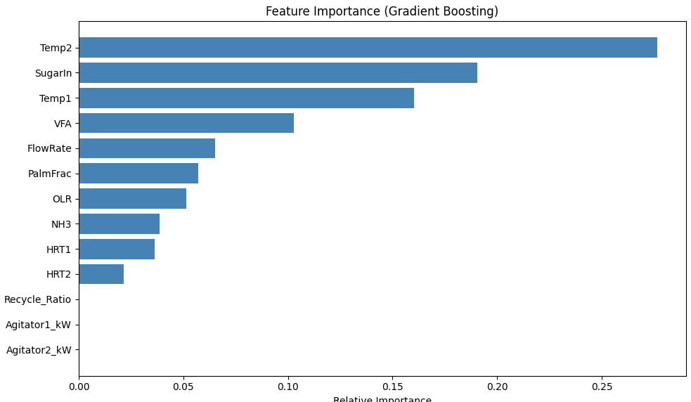

# Biogas-Optimization-Pipeline-using-Simulation-and-ML
Prof. Vibhor Pandhare – IIT Indore

## Problem Statement
This project aims to optimize methane yield from a two-stage anaerobic digester by simulating plant behavior and training a machine learning model to predict outcomes. Due to limited real-world sensor data, we developed a realistic process model to generate synthetic yet physically grounded data for analysis.

##Dataset
Data Source: Generated using a custom ADM1-inspired simulator

Data Size: ~1000 parameter combinations

## Variables:

Inputs: Flow rate, Temperature (T1, T2), Agitator power, Recycle ratio, Palm oil fraction, Sugar input

Derived: OLR, HRT1, HRT2

Outputs: Methane Yield (L CH₄/L), Biogas Flow, VFA, NH₃

Format: CSV (training + validation sets)

## Workflow
## Mathematical Modeling (Part 1)

Developed a mechanistic, two-stage anaerobic digestion model using ODEs.

Incorporated biological inhibition penalties for VFA, NH₃, poor mixing, and off-optimal temperature.

## Data Generation

Simulated hundreds of input combinations to build a synthetic dataset.

Exported training and validation datasets for ML.

## ML Modeling 

Trained a Gradient Boosting Regressor to predict methane yield.

Achieved high accuracy using 5-fold cross-validation (R² ~0.92).

## CLI-based Prediction 

Simple command-line tool for predicting CH₄ yield from custom input.

Visualization & Analysis

Generated trend plots, feature importance, and density contours to analyze variable impact.

## Streamlit Dashboard

Built a 4-level role-based dashboard (Technician, Engineer, Manager, Executive).

Real-time input, CH₄ prediction, graph summaries, alerts, and system insights.

## Why This Approach?
Lack of Plant Data: A mathematical model helped simulate plant behavior realistically.

Penalty Functions: Ensured outputs reflect known limitations (e.g., ammonia inhibition).

ML Interpretability: Feature importance graphs helped explain the influence of each variable.

Scalability: Framework can adapt to more sensor inputs or field data when available.

## Results & Visualizations
1. Feature Importance Plot

2. Trends Identified

CH₄ yield increases with temperature (optimum ~37°C)

Over-recycling or high NH₃/VFA reduces yield

Palm oil fraction improves yield (up to ~0.3), but excess leads to inhibition

3. Contour Graph Example

## Contributors
M. Viswajith
BTech Mechanical Engineering, IIT Indore

## Tools & Technologies
Programming: Python

Modeling: NumPy, SciPy (odeint)

ML: scikit-learn, joblib

Visualization: matplotlib, seaborn

App: Streamlit

## Conclusion
This project bridges process simulation and machine learning to optimize biogas generation. It lays the groundwork for a digital twin–like system and provides useful insights even without real-time sensor data.

